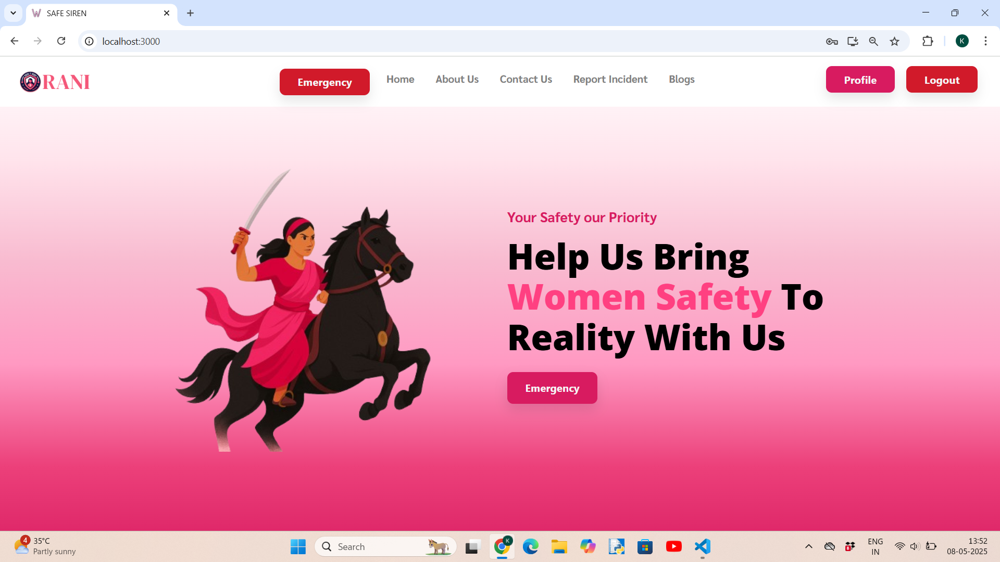

# 👑 RANI — Real-time Alert and Navigation Interface

### 🏆 3rd Place Winner — HMRITM Tech Fest Project Exhibition Challenge

**RANI** is a women's safety web application developed as part of the Tech Fest Project Exhibition at **HMRITM**. Competing against several teams from various colleges, RANI secured the **3rd position** by presenting an innovative solution focused on enhancing women's safety through real-time alerts and smart navigation features.


## 📌 Overview

RANI offers a powerful platform for women to:

* **Send distress signals**
* **Report incidents**
* **Receive rapid assistance in emergencies**

By integrating **geolocation services**, **real-time databases**, and **communication tools**, RANI ensures timely support when it matters most.


## 🚨 Key Features

* **📍 One-Tap Distress Signal**

  * Instantly fetches and shares the user's real-time location.
  * Sends immediate notifications to registered emergency contacts and all users in the **same PIN code area**.
  * Shares location coordinates and map via email.

* **📝 Incident Reporting**

  * Users can report incidents using a detailed form with optional media attachments.

* **📊 Admin Dashboard**

  * Secure login for admins to monitor and manage incidents and alerts.
  * Includes incident filtering, status updates, and real-time data insights.

* **📡 Real-Time Alerts with PIN Code Matching**

  * Notifies nearby users (within the same PIN code) to create a community-driven safety net.

* **📰 Blog Section**

  * Educational articles on women's safety, legal rights, and self-defense tips.

* **🏢 NGO Contacts**

  * Verified list of NGOs offering support, counseling, and emergency assistance.


## 🛠 Technologies Used

* **Frontend**: React.js, Tailwind CSS
* **Backend**: Node.js, Express.js
* **Database**: MongoDB (with Mongoose ODM)
* **Real-Time Features**: HTML5 Geolocation API, EmailJS / Nodemailer
* **Authentication**: JWT-based login system for users and admins


## 🚀 Getting Started

Follow these steps to set up and run the RANI project locally:

### 1️⃣ Clone the Repository

```
git clone https://github.com/Khushibansal777/Women-Safety-.git
cd WomenSafetyWebApp-main
```

### 2️⃣ Install Backend Dependencies

```
cd server
npm install
```

### 3️⃣ Install Frontend Dependencies

```
cd ../WomenSafetyWebApp-main
npm install
```

### 4️⃣ Configure Environment Variables

Create a `.env` file inside the `/server` directory with the following keys:

```
MONGO_URI=your_mongo_connection_string
EMAIL_USER=your_email@example.com
EMAIL_PASS=your_email_password
JWT_SECRET=your_jwt_secret
```

### 5️⃣ Start the Backend Server

```
cd server
npm start
```

### 6️⃣ Start the Frontend

```
cd ../WomenSafetyWebApp-main
npm start
```

### 7️⃣ Access the Application

Open your browser and visit:
[http://localhost:3000](http://localhost:3000)


## 🧪 Usage

### 👤 For Users:

* Register or log in to access features.
* Trigger SOS alerts using the one-tap distress signal.
* Report safety incidents with detailed descriptions and media attachments.

### 🔐 For Admins:

* Navigate to the `/admin` route.
* Log in to manage user alerts and reports.
* Monitor real-time incidents and review submitted data/media.

### Screenshot


